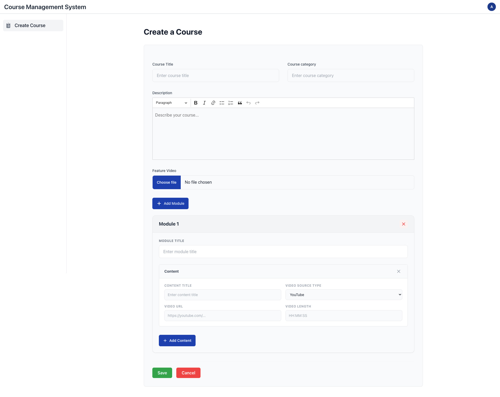

## Course Management System – Laravel Based Project

A Laravel-based **Course Management System** where users can:

- Create Courses  
- Add Multiple Modules inside a Course  
- Add Multiple Contents inside each Module  
- Upload Feature Video  
- Save all data to database with relationships  

This project demonstrates clean Laravel architecture, validation, database design and dynamic frontend form handling.

---

## 🚀 Features

- Create Course
- Upload Feature Video (file, not URL)
- Add Unlimited Modules
- Add Unlimited Content under each Module
- Nested module-content structure
- Frontend + Backend validation
- Dynamic form using jQuery
- Video upload & storage support
- Relational database structure

---

## 🛠️ Technology Stack

- Laravel 12.0
- PHP 8.2
- MySQL
- Tailwind CSS
- jQuery
- HTML5 / CSS3
- JavaScript (Vanilla)

---

## 🗂️ Database Structure

- Courses Table  
- Modules Table  
- Contents Table  

**Relationships**

- One Course → Many Modules  
- One Module → Many Contents  

---

##  Project Setup Guide

Follow the steps below to run the project on your local machine.

### ✅ Prerequisites

Make sure you have the following installed:

- PHP 8.1 or higher
- Composer
- MySQL 
- Node.js & NPM
  
1. git clone https://github.com/mdwasimdev1/laravel-course-management-system.git
2. cd laravel-course-management-system
3. composer install
4. npm install
5. cp .env.example .env
6. php artisan key:generate
7. DB_DATABASE=course_management
8. php artisan migrate
9. php artisan storage:link
10. npm run dev
11. php artisan serve

## 📸 Screenshots

###  Course Create Page

